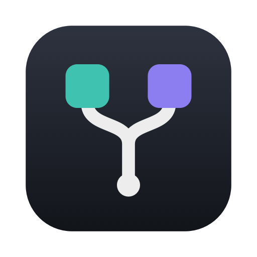
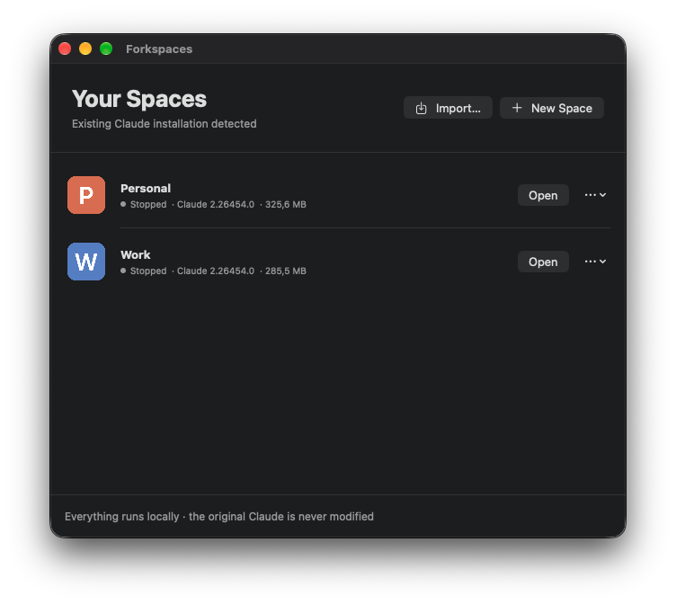
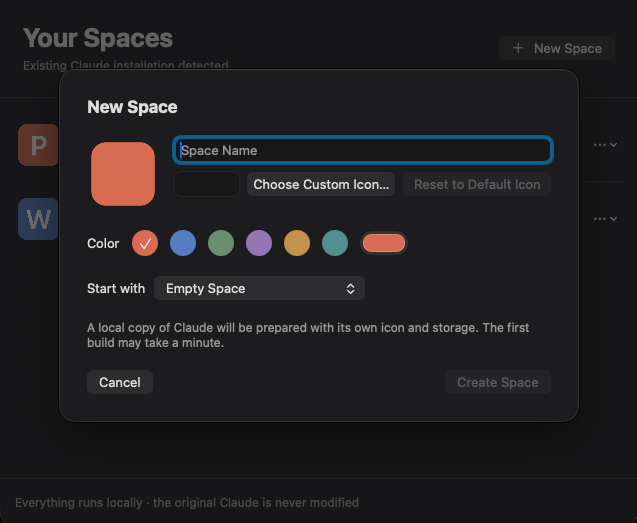
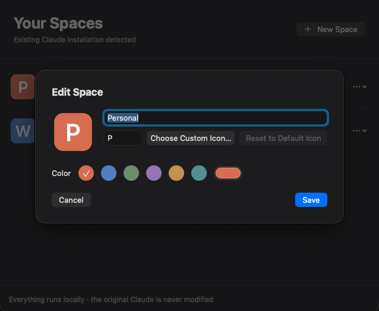

<p align="center"></p>

<h1 align="center">Forkspaces</h1>

<p align="center"><b>Forkspaces creates isolated spaces for desktop apps on macOS.</b></p>

Forkspaces is a native macOS utility for running isolated app profiles side by side.
Initially built for Claude Desktop, Forkspaces creates independent spaces with separate sessions,
application data, launchers and custom icons — without modifying the original application.

Forkspaces is free and open source under the GPL-3.0.

<p align="center"></p>

<p align="center">
  
  
</p>

## Features

- Multiple isolated Claude Desktop spaces
- Run multiple accounts side by side
- Independent sessions and app data
- Custom icons (PNG, JPEG, HEIC), initials and colors
- Duplicate spaces
- Disk usage and Claude version shown per space
- Export and import spaces (password-encrypted)
- Import existing Claude data
- Native macOS app (SwiftUI, no dependencies)
- Local-only
- Original Claude installation remains untouched

Today Forkspaces supports Claude Desktop only. The design could support other apps later; nothing beyond Claude is promised yet.

## Requirements

- macOS 13 or later
- Apple Silicon or Intel
- [Claude Desktop](https://claude.ai/download) installed in `/Applications`

## Installation

1. Download `Forkspaces.dmg` from [Releases](../../releases) and open it.
2. Drag `Forkspaces.app` to `Applications`.
3. Release builds are not notarized yet. The first time, open it from **System Settings → Privacy & Security → Open Anyway**
   (or run `xattr -dr com.apple.quarantine /Applications/Forkspaces.app`).

## Build from Source

Requires Xcode or the Command Line Tools (`xcode-select --install`).

```sh
git clone https://github.com/gustavopmaia/forkspaces.git
cd forkspaces
./scripts/build-release.sh          # → build/Forkspaces.app and build/Forkspaces.dmg
open build/Forkspaces.app
```

Builds are signed ad-hoc by default, so no Apple Developer account is needed.
To sign with your own identity, use `SIGN_IDENTITY="Developer ID Application: …" ./scripts/build-release.sh`.
The version comes from [`VERSION`](VERSION).

Integration tests build real spaces in a throwaway folder (they need Claude Desktop installed):

```sh
build/Forkspaces.app/Contents/Resources/ForkspacesTool integration build/integration
```

To check window-manager compatibility, open a disposable test space and run
`swift scripts/check-window-accessibility.swift <space-bundle-id>` from a terminal with
Accessibility permission. This checks its process identity and resizes/restores a window
through the same macOS API used by Rectangle.

## How It Works

```
/Applications/Claude.app  (never modified)
        │  intact, Anthropic-signed APFS copy inside each launcher
        ▼
~/Applications/Forkspaces/Claude Work.app      ──▶  …/Forkspaces/profiles/work-…/
~/Applications/Forkspaces/Claude Personal.app  ──▶  …/Forkspaces/profiles/personal-…/
```

Each space gets its own launcher with a unique bundle identifier and icon, an intact signed copy
of Claude, and a separate data directory (`--user-data-dir`). The launcher opens that copy through
LaunchServices and holds the space lock until it closes. Copies use APFS clones, so they take
little extra disk space. After Claude updates, use **Rebuild from Claude** on each space.
After updating Forkspaces, rebuild existing spaces to pick up launcher fixes as well.

Spaces separate accounts; they are not a security sandbox. All spaces run as your macOS user,
and some system logs and services remain shared, including Claude's macOS Keychain groups.

### Built-in browser and computer connection

Rebuild existing spaces after updating Forkspaces. Older launchers re-signed Claude, removing
Anthropic's Keychain authorization and preventing Cowork from identifying the connected desktop.
Current launchers preserve the official signature and provisioning profile, including the device-key
access group. The original `/Applications/Claude.app` does not need to be running.

Open spaces from Forkspaces or their named launcher apps. The signed inner app retains Claude's
name and icon in macOS; pin the **named launcher**, not the inner Claude app, to the Dock. Starting
the inner app directly omits the space's data-directory arguments. Browser login routing is forwarded
to the selected runtime path; stopping a space targets that path, not every app with Claude's bundle ID.

### Cowork disk usage

After Cowork is installed in two spaces, close both and choose **Optimize Cowork Storage**
from a space's menu. Forkspaces compares their VM images and uses APFS clones to share
matching blocks, preserving the selected image byte-for-byte. Session disks and VM identities
stay separate. No symlinks or hardlinks are used, and writes remain independent.

Updated space launchers also try this once per image on startup when another space is stopped.
The initial Cowork download still needs its normal disk space; optimization happens on a later
launch. Rebuild existing spaces to get this automatic behavior. Optimization can take a minute
and requires APFS on the same volume. Reported file sizes include shared blocks and will not
necessarily decrease; APFS snapshots can delay the recovery of free space.

## Privacy

Everything runs locally on your Mac.

- No backend, no Forkspaces account, no telemetry, analytics or tracking, no cloud sync.
- Forkspaces never reads chats, cookies, tokens, credentials or history.
- Duplicate and import copy Claude's data folder as an opaque whole. The only Claude file Forkspaces
  edits is a space's own `claude_desktop_config.json`, to switch off auto-update and deep-link
  registration inside that space.
- Importing the original installation also copies local Claude Code transcripts from
  `~/.claude/projects` into the space's isolated `ClaudeCode/projects` folder.

## Contributing

See [CONTRIBUTING.md](CONTRIBUTING.md). Report security issues privately as described in [SECURITY.md](SECURITY.md).

## License

Forkspaces is free software under the **GNU General Public License v3.0** — see [LICENSE](LICENSE).

You can use, study, modify and share it. If you distribute a modified version, it must stay under the GPL-3.0 with its source available.

## Unofficial Project

Forkspaces is an independent project and is not affiliated with, endorsed by, or sponsored by Anthropic.
Claude is a product and trademark of Anthropic.
Forkspaces does not distribute Claude Desktop. Users must install the official Claude Desktop application separately.
